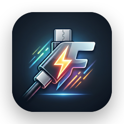
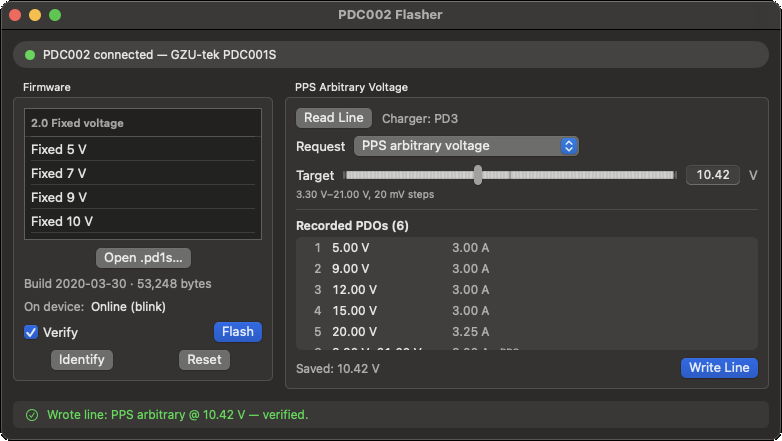

<div align="center">



# PDC002 Flasher for macOS

**用於替 WITRN PDC002 USB-C Power Delivery 觸發線燒錄韌體的原生 macOS app** —
取代只能在 Windows 上跑的 `WITRN Upgrade 4.0.exe`。

[](https://www.apple.com/macos/)
[](#-建置)
[](#-運作原理)
[](https://github.com/Crazycurly/PDC002-gui/releases/latest)
[](https://github.com/Crazycurly/PDC002-gui/releases)

[English](README.md) · **繁體中文**

</div>

---

PDC002 內建的 HID 燒錄器（USB VID `0x0716`、PID `0x5036`）接受 52 KB 的韌體
映像，這些映像決定了線材向 PD 電源要求哪一種電壓／模式 —— 固定 5–20 V、
最高電壓、輪詢、EPR/AVS 15–28 V、小米 MI 120 W，以及可由電腦設定的
**「線上（online）」** 韌體。本 app 在 macOS 上原生驅動該燒錄器：不需要
Windows、不需要虛擬機、也不需要任何第三方執行環境。

線材本身請見[產品頁面](https://www.witrn.com/?p=556)。

<div align="center">



</div>

## ⚡ 快速開始

1. 到 [Releases 頁面](https://github.com/Crazycurly/PDC002-gui/releases/latest)
   下載最新的 [**`PDC002-vX.Y-macos.zip`**](https://github.com/Crazycurly/PDC002-gui/releases/latest)。
2. 解壓縮後把 `PDC002.app` 移到**應用程式**資料夾。
3. 第一次啟動：在 app 上**按右鍵 →「打開」**（本 app 為 ad-hoc 簽章），或用
   `xattr -dr com.apple.quarantine PDC002.app` 清除隔離屬性。
4. 插上 PDC002 —— app 會自動偵測到燒錄器。

> 需要 **macOS 13 以上**、**Apple Silicon** 機型。

## ✨ 功能

- **即時偵測** PDC002 燒錄器（插入／拔除）。
- **內建 28 組韌體預設**（來自官方 `PDC002固件_230713` 套件），以英文標籤
  分組 —— 也可以開啟自訂的 `.pd1s` 檔案。
- **辨識（Identify）** —— 讀取線材上的韌體並與內建預設比對。
- **安全燒錄**，附即時進度（抹除 / 寫入 / 驗證），並在重置裝置「之前」先做
  讀回驗證，因此驗證失敗時絕不會讓線材重開機進入壞掉的映像。
- **PPS 任意電壓**（線上 / 電腦設定韌體）：
  - **讀線（Read Line）** 會從設定區塊讀出充電器記錄的 PDO 清單與目前選擇，
    並把這些 PDO 以表格列出（目前生效的會標示）。
  - 選擇要求模式 —— 最低 / 最高 / 輪替，或指定某個 PDO —— 若是 PPS PDO，
    還可用滑桿或直接輸入設定目標電壓（會被夾在充電器允許的範圍內，並對齊到
    20 mV 的級距）。
  - **寫線（Write Line）** 以「讀取—修改—寫入」搭配讀回驗證的方式儲存；會保留
    原本記錄的 PDO 清單，且不會發出重置。
- **重置（Reset）** 指令，以及底部顯示操作進度與最後結果的狀態列。

## 🪟 版面

雙欄視窗：左側為韌體選擇與燒錄操作，右側把空間留給最常用的 PPS 任意電壓面板，
底部則是一條橫跨整個視窗的狀態列。

## 🔨 建置

需要 **macOS 13 以上**與 **Xcode**（SwiftUI / XCTest 需要）。無任何第三方相依套件。

```sh
swift test               # 不需硬體的協定測試
Scripts/make_app.sh      # release 建置 → ad-hoc 簽章的 PDC002.app
open PDC002.app
```

若 `xcode-select -p` 指向的是 CommandLineTools，腳本會自動透過
`DEVELOPER_DIR` 切換到 Xcode 工具鏈。

app 圖示由 `AppIcon-source.png` 算繪而成：`make_app.sh` 會執行
`Scripts/make_icon.swift`，它會定位畫面中明亮的主體、以其為中心裁切出正方形，
再裁進 macOS 的圓角「squircle」並加上柔和的投影 —— 每個尺寸都重新算繪以保持
銳利。產生的 `.icns` 會被打包進去，且只在來源圖檔或產生器有變動時才重新產生。

本 app 不使用沙盒（unsandboxed）並以 ad-hoc 簽章供本機使用；廠商自訂的 HID
裝置不需要特別的權限（entitlement），也不需要「輸入監控」權限。

## 🔬 運作原理

- **HID 協定**（`Sources/PDC002Kit/Protocol/`）：64 位元組的回報封包，含
  `FF 55` 標頭、命令位元組、酬載，以及兩個加法式校驗和。命令包含：進入燒錄
  模式（3）、開始／結束寫入（5/4）、抹除頁面（8）、寫入（9）、讀取資訊（10）、
  批次讀取（11）、重置（23）。韌體佔用 flash 位址 `0x2C00–0xFBFF`
  （52 × 1 KB 頁面）；寫入為頁面對齊的 25×40 + 24 位元組區塊，與官方工具的
  流量相符。
- **PPS 設定區塊**（`PPSConfig.swift`）：線上韌體在 flash `0xFC00` 保存一個
  52 位元組區塊，內含充電器記錄的 PDO 清單（4 位元組的模式字組）、選擇的要求
  模式、儲存的目標電壓，以及結尾的加法式校驗和。它以 read-info 讀取，並以
  「單頁抹除 + 40 / 12 位元組寫入區塊」的方式改寫；PDO 解碼比照
  `pdc-control` 的 `readModes`。重新編碼會保留每一個未編輯的位元組，並以差量
  方式推導出新的校驗和，因此不會誤改任何未辨識的欄位。
- **.pd1s 容器**（`PD1S.swift`、`SBox.swift`）：整個檔案會通過一張固定的
  256 位元組替換表。解碼後的檔案以 ASCII 魔術字串 `gzutapp` 與一個建置日期
  開頭，後面接著原始的 53,248 位元組韌體本體。`Scripts/gen_sbox.py` 可由一組
  已知的原始／編碼配對重新產生該替換表。
- 協定層是建立在 `FrameTransport` 抽象之上的純 Swift；`Tests/PDC002KitTests`
  會以擷取到的 USB 軌跡與一個模擬裝置來測試它，包含一次完整的燒錄 + 驗證流程。

## 🙏 致謝

HID 協定由 [sambenz/PDC002](https://github.com/sambenz/PDC002)
（`pdc002.py`、Saleae 軌跡）逆向工程而來 —— 本 app 在其成果之上鏡像並延伸。
韌體映像為 WITRN 官方隨其 Windows 工具一同發佈的版本。線材本身為
[WITRN PDC002](https://www.witrn.com/?p=556)。

## ⚠️ 安全須知

燒錄會修改線材的韌體。本 app 會在重置前以讀回方式驗證 —— 但請務必只燒錄
專供 PDC002 使用的映像。
